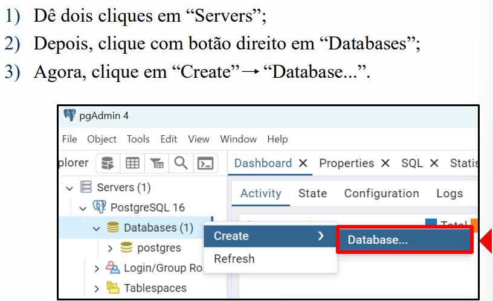
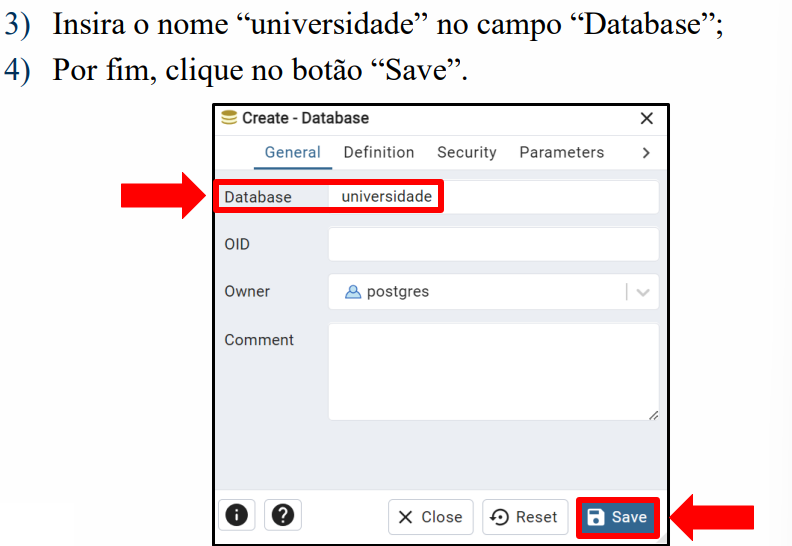
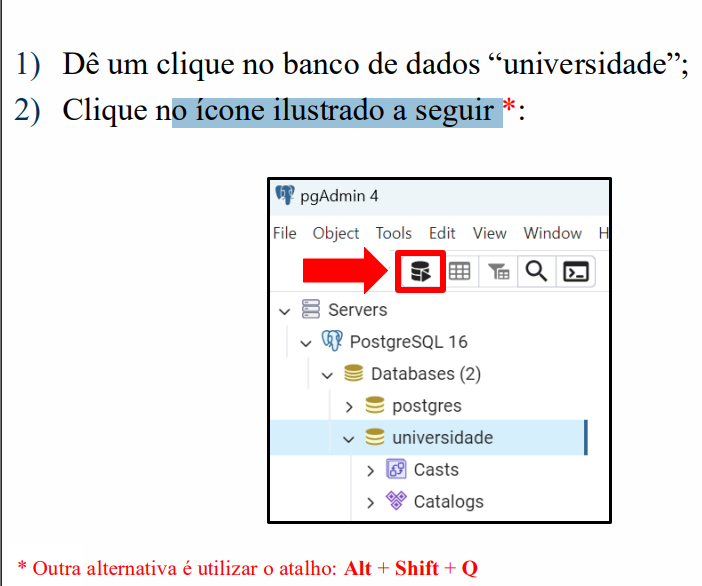
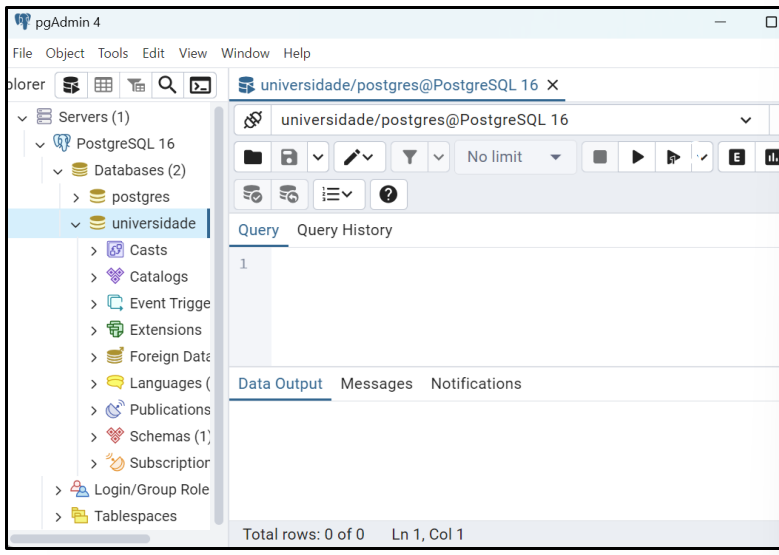
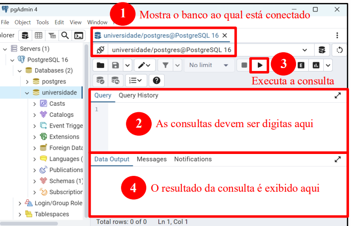
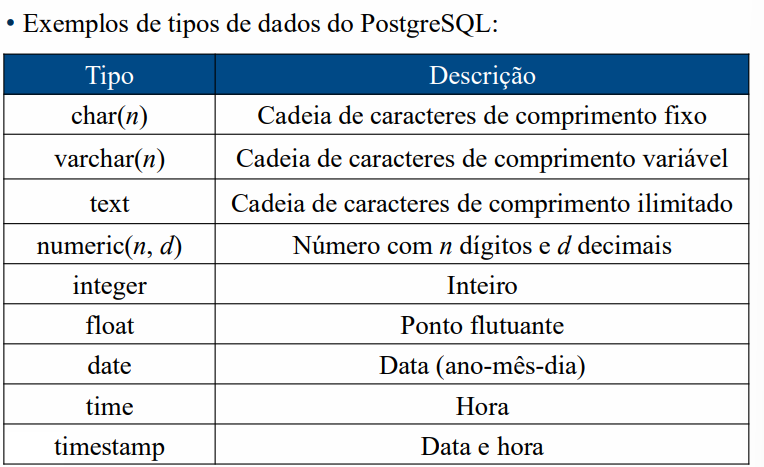
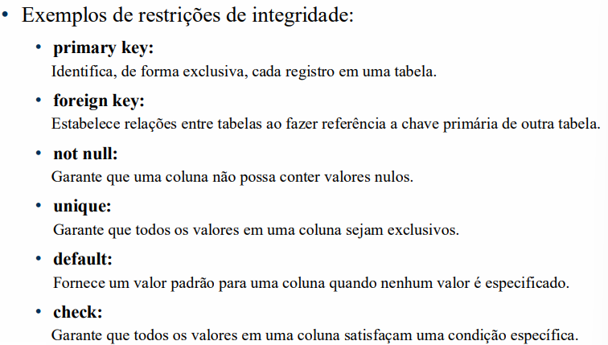
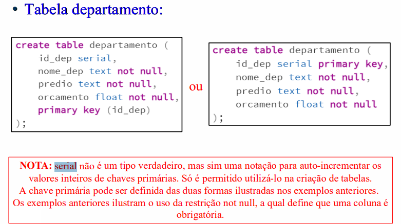
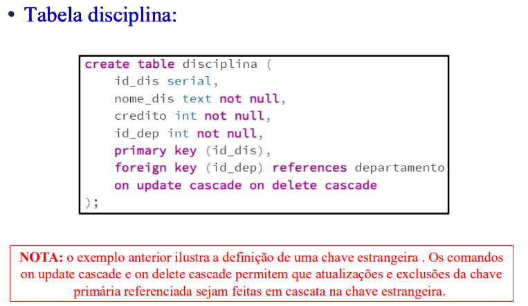

## PostgreSQL
- Definição: PostgreSQL é um sistema de gerenciamento de banco de dados relacional de código aberto, conhecido por sua robustez, extensibilidade e conformidade com padrões SQL.
- Relacional: Utiliza tabelas para armazenar dados, permitindo relacionamentos entre diferentes conjuntos de dados.
- SQL: É uma linguagem de banco de dados com recursos para definir a estrutura dos dados, consultar dados, atualizar dados e especificar restrições de segurança.


### A SQL é composta pelas seguintes partes:
> DDL (Data Definition Language ou linguagem de definição de dados):

- Permite determinar o esquema do banco de dados, bem como alterá-lo e exclui-lo.
- Exemplos de comandos DDL: CREATE, ALTER, DROP, TRUNCATE, COMMENT, RENAME.

> DML (Data Manipulation Language ou linguagem de manipulação de dados):
Permite a manipulação dos dados, isto é, a inclusão, alteração e exclusão de dados.

> DCL (Data Control Language ou linguagem de controle de dados):
Permite controlar a licença e autorização de acesso dos usuários para com os dados.

> DTL (Data Transaction Language ou linguagem de transação de dados):
Oferece comandos para trabalhar com as transações.

> DQL (Data Query Language ou linguagem de consulta de dados):
Permite a consulta de dados.

``` MD
**CREATE**: Cria um novo objeto no banco de dados, como uma table, user, sequence, index, view, trigger e entre outros.
**ALTER**: Modifica a estrutura de um objeto existente no banco de dados.
**DROP**: Remove um objeto do banco de dados.
**TRUNCATE**: Remove todos os registros de uma tabela, mas mantém sua estrutura.
**COMMENT**: Adiciona um comentário descritivo a um objeto do banco de dados.
**RENAME**: Renomeia um objeto existente no banco de dados.

```

---
- Passos: 
---





---

- Sintaxe do comando CREATE TABLE:
``` MD
CREATE TABLE nome_da_tabela (
    nome_da_coluna1 tipo_de_dado [restrições],
    nome_da_coluna2 tipo_de_dado [restrições],
    ...
    nome_da_colunaN tipo_de_dado [restrições]
);
```

> Tipos de dados comuns em PostgreSQL:
---

- *BIGINT*: Usado para armazenar números inteiros muito grandes.

---

>  As restrições de integridade são cruciais para:
- Evitar a falta de dados;
- Garantir que os dados estejam de acordo com os seus tipos;
- Garantir que os dados estejam nos intervalos de valores esperados;
- Manter relações adequadas entre os dados de diferentes tabelas.

---


---
- Sintaxes:
``` sql
--- Primary Key:
primary key (<atributo 1>,
<atributo 2>,
...
<atributo n>)


-- Foreign Key:
foreign key (<atributo 1>,
<atributo 2>,
...
<atributo n>)
references <tabela referenciada>
on update cascade on delete cascade

-- Not Null:
<atributo> <tipo de dado> not null

-- Unique:
<atributo> <tipo de dado> unique

-- Default:
<atributo> <tipo de dado> default <valor padrão>

-- Check:
<atributo> <tipo de dado> check (<condição>)
```

---



---

- Sintaxe do comando DROP TABLE:
``` MD
drop table <tabela>;
```

- Alter Table:
``` MD
Exemplos de comandos que podem ser utilizados com o alter table:
- rename to
- add primary key
- add foreign key
- add <atributo>
- add unique
- add check
- alter type
- alter not null
- alter set default
- drop
```
- sintaxe: 
``` sql
-- Para tabelas:
alter table <atual nome da tabela>
rename to <novo nome da tabela>;

-- Para atributos:
alter table <tabela>
rename <atual nome do atributo> to <novo nome do atributo>;

-- Adição de chave primária:
alter table <tabela>
add primary key (<atributo 1>,
<atributo 2>,
...
<atributo n>);

-- Exemplo:
create table aluno (
    id serial,
    nome varchar(100) not null,
    idade int,
    primary key (id)
);

alter table aluno
add foreign key (id)


-- Para add foreign key
alter table <tabela>
add foreign key (<atributo 1>,
<atributo 2>,
...
<atributo n>)
references <tabela referenciada>
on update cascade on delete cascade;


-- Para adicionar um novo atributo:
alter table <tabela>
add <atributo> <tipo de dado> [restrições];

-- Vários atributos:
alter table <tabela>
add <atributo 1> <tipo de dado> [restrições],
add <atributo 2> <tipo de dado> [restrições],
...
add <atributo n> <tipo de dado> [restrições];

-- Adição de unique:
alter table <tabela>
add unique (<atributo 1>

-- add check:,
alter table <tabela>
add check (<condição>);


-- alter type:
alter table <tabela>
alter <atributo> type <novo tipo de dado>;


-- alter set not null:
alter table <tabela>
alter <atributo> set not null;

-- alter set default:
alter table <tabela>
alter <atributo> set default <valor padrão>;

-- drop:
alter table <tabela>
drop <atributo>;

-- drop varios
alter table <tabela>
drop <atributo 1>,
drop <atributo 2>,
...
drop <atributo n>;
```

## Documentação SQL - Partes restantes:
https://www.postgresql.org/docs/current/