## Banco de Dados: 01 – Introdução aos Bancos de Dados
### Compartilhamento de Dados
- A adoção de recursos de tecnologia da informação nas organizações geralmente se dá de maneira progressiva, por meio de implementações incrementais que acompanham a maturidade dos processos internos.

- Imagine uma instituição com algumas funções secretaria, coordenação pedagogica e biblioteca. Cada setor usa um sistema próprio e não compartilha
informações, pode acontecer redundância ou inconsistência.

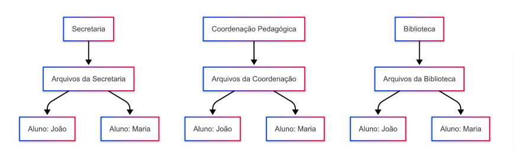

- O problema é o isolamento: 
- Redundância! Quando uma informação ou um conjunto de informações está representada ou foi gravada mais uma vez dentro de um determinado conjunto de dados sem que seja necessário.

- Redundância Controlada
- Ocorre quando o sistema ou o software gerencia explicitamente a existência de múltiplas cópias de um mesmo dado. (Ex: cache, replicação)

- Redundância Não Controlada 
- Acontece quando a duplicação de dados ocorre de maneira não supervisionada pelo sistema, ficando sob responsabilidade do usuário ou de processos manuais. Essa condição frequentemente resulta em inconsistência, divergência de dados e aumento da complexidade na manutenção da integridade.

### Como lidar com essa situação: 
- Tecnicamente 
- Recomendada é implementar mecanismos de compartilhamento estruturado de dados entre os sistemas. 
- Didaticamente 
- por meio do compartilhamento de dados entre os setores da organização. 
- Compartilhamento eficiente de dados e integração entre os sistemas!

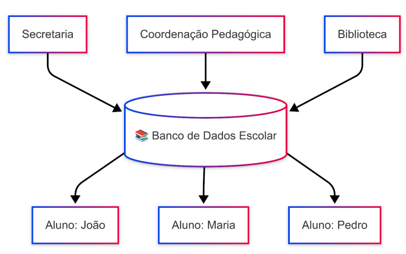

- A solução para os desafios relacionados ao compartilhamento de dados entre diferentes setores de uma organização é a adoção de um sistema de banco de dados centralizado, que permita o acesso integrado, seguro e consistente às informações.

## Dados X Informação
- Dados: São elementos brutos, desprovidos de contexto ou interpretação, que representam fatos, eventos ou medidas. Eles podem ser números, textos, sinais ou registros capturados e armazenados por sistemas computacionais, ainda sem tratamento ou análise.

- Informações: É o resultado do processamento, organização e interpretação dos dados, atribuindo-lhes significado e utilidade no contexto em que são analisados. Trata-se de um conjunto de dados tratados que permite subsidiar decisões, gerar conhecimento ou apoiar processos organizacionais.

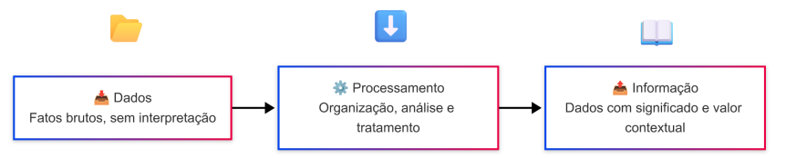

## O Banco de Dados:
- Banco de Dados (BD ou DB) é uma estrutura computacional organizada, composta por um conjunto de dados relacionados e metadados associados, armazenados de forma persistente e acessados por meio de linguagens específicas.

- Sistema de Gerenciamento de Banco de Dados (SGBD) são um conjunto de softwares que fornece os recursos necessários para definir, construir, manipular e administrar bancos de dados. Atuando como uma camada intermediária entre os dados e os usuários ou aplicações, oferecendo funcionalidades como controle de concorrência, recuperação de falhas, segurança, integridade e independência dos dados.

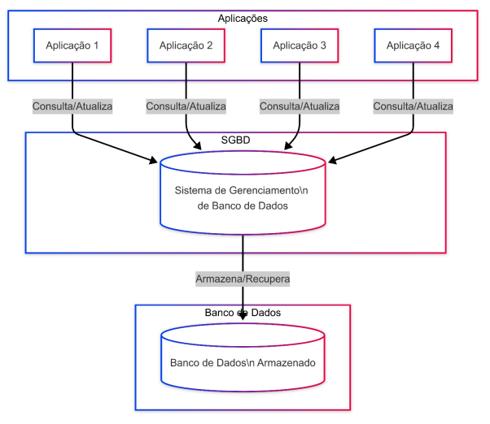

- Vantagens 
- Compartilhamento de Dados 
• Permite acesso concorrente e controlado aos dados por múltiplos usuários e aplicações, garantindo consistência e evitando conflitos de escrita/leitura através de mecanismos como controle de concorrência e transações ACID

- Segurança de Dados 
• Oferece controle de acesso granular (ex.: permissões por usuário, roles) e técnicas de criptografia (dados em trânsito/repouso), além de auditoria (logs de acesso/modificação).

- Integração dos Dados 
• Centraliza dados em um esquema unificado, eliminando silos e redundâncias, com chaves primárias/estrangeiras para manter relações consistentes. 
- Minimização de Inconsistências 
• Aplica restrições de integridade (ex.: UNIQUE, NOT NULL) e triggers para validar regras de negócio, evitando anomalias em operações de INSERT/UPDATE/DELETE.
- Acesso Eficiente aos Dados
- Tomada de Decisão Aprimorada
- Produtividade do Usuário Final

### Tipos de bancos de dados:
- Podem ser baseados em: • Números de Usuários • Localização dos Dados • Uso dos Dados

+ Numeros de usuários: 
- Monousuário - Definição: Projetado para acesso exclusivo por um único usuário por vez.
- Multiusuário - Definição: Permite acesso simultâneo por múltiplos usuários, com controle de concorrência.
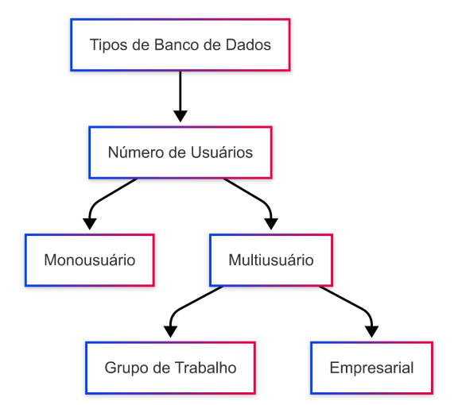

+ Por localização dos dados
- Centralizado - Definição: Dados armazenados em um único servidor físico/lógico.
- Distribuído - Definição: Dados fragmentados em múltiplos nós (físicos ou geográficos).

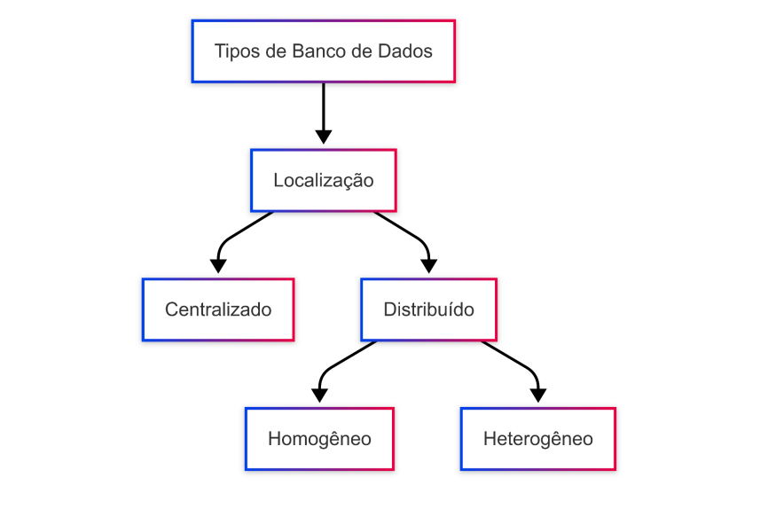

+ Por Utilização dos Dados
- Operacional (OLTP) - Definição: Otimizado para transações rápidas (INSERT/UPDATE/DELETE).

- Data Warehouse (OLAP) - Definição: Focado em análise histórica e agregados.

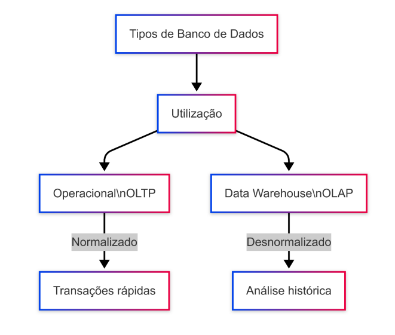

- Um Sistema de Banco de Dados (SBD) é um conjunto integrado de componentes que define, regula e gerencia a coleção, armazenamento, recuperação, manipulação e disseminação de dados em um ambiente computacional, garantindo:

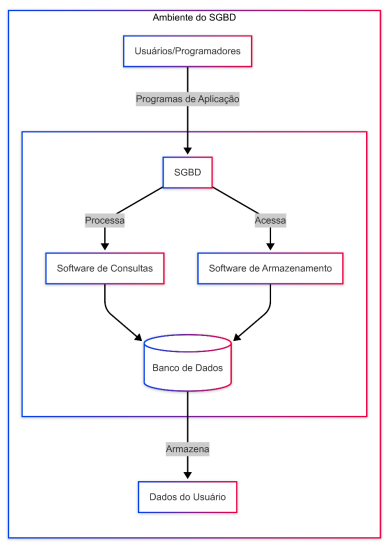

- Um Modelo de Banco de Dados é um framework formal que define a estrutura, operações e restrições de um banco de dados, determinando como os dados são armazenados, organizados e manipulados.

- Tipos de Modelos de Dados 
• Modelo Conceitual
- Representação abstrata e dos dados e seus relacionamentos, focada nas regras de negócio. Define o que o sistema deve armazenar, sem detalhes de implementação. Características Utilizaremos diagramas Entidade-Relacionamento (ER).

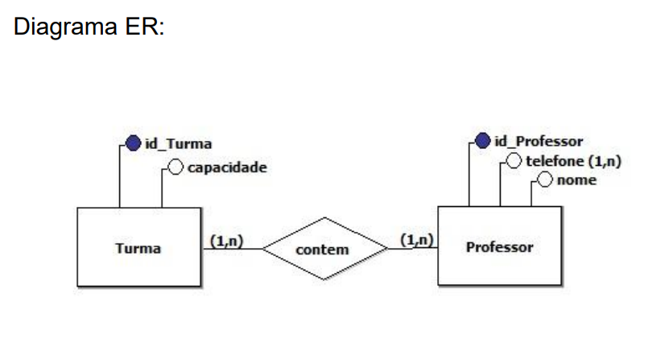
• Modelo Físico
- Estrutura do banco de dados a partir da perspectiva dos usuários e do SGBD, sem considerar detalhes de implementação física. Define entidades, atributos, relacionamentos, tipos de dados e restrições, sendo expresso por meio de um modelo relacional (tabelas, colunas e chaves) Características Representa como os dados são organizados logicamente no SGBD.
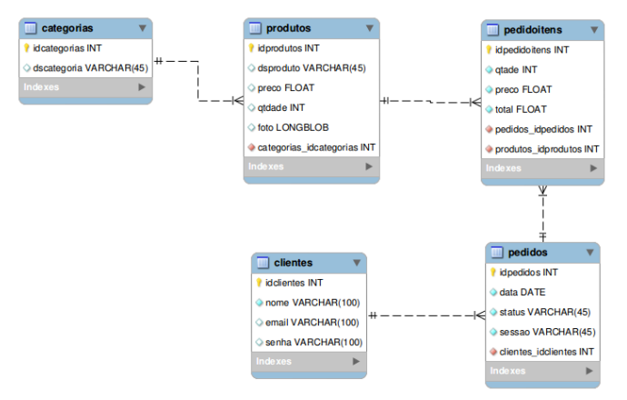

• Modelo 
- Representa a implementação concreta do banco de dados dentro de um SGBD específico. Ele descreve os detalhes técnicos de armazenamento, como estruturas de arquivos, índices, partições e métodos de acesso, com foco em desempenho, segurança e alocação de recursos. Características Representa como os dados são armazenados no sistema.
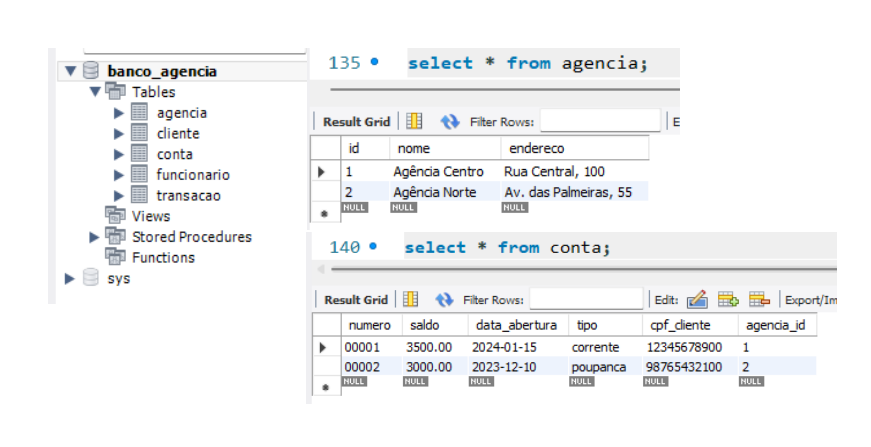

