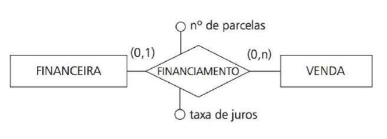

## Modelo conceitual - Introdução à Entidades e Relacionamentos
- Esta abordagem representa a estrutura lógica de um banco de dados através de *diagramas (DER)* que capturam entidades, seus atributos e os relacionamentos (com suas cardinalidades) entre elas.

- Abordagem **entidade-relacionamento (ER)** é uma técnica de modelagem de dados que descreve a estrutura lógica de um banco de dados através de diagramas.

### Diagrama ER (DER) - Representação Gráfica
- O DER contém de maneira estruturada, toda a abstração das relações entre o componentes citados anteriormente, a partir daqui, a complexidade dos mesmos irá aumentar a cada modificação. Focando em: 
• Entidade: Pessoa, Aluno, Disciplina, Departamento. 
• Relacionamento: Associações entre entidades. Lotação, Adota, Entrega, Aluga.

### Ocorrências de Entidades/Relacionamentos
- Essas ocorrências não são únicas, podendo um conjunto de
entidades se relacionar com outros conjuntos de entidades,
inclusive (ou não) de maneiras diferentes. 

### Diagrama de ocorrências
- Onde: p = produto, p,d = está (relacionamento) e d = venda.
---

---

## Autorrelacionamento
- O relacionamento recursivo, ocorre quando uma entidade se associa a si mesma por meio de um relacionamento.
- *Mesma Entidade*: Envolve apenas uma entidade, mas relaciona suas diferentes ocorrências.
- *Papéis Distintos*: As ocorrências desempenham funções diferentes no relacionamento (ex.: supervisor e supervisionado).
- *Cardinalidade Variável*: Pode ser 1:1, 1:n ou n:n, dependendo da natureza da associação.

- Exemplo: Redes sociais (um usuário segue outro).
- Em um Diagrama ER, o autorrelacionamento é representado por um losango conectado à mesma entidade por duas linhas, cada uma com um rótulo de papel.
---

---
## Papeis:
- O papel em um relacionamento define a função específica que uma ocorrência de entidade desempenha dentro de uma associação. Ele é usado para: 
• Diferenciar o significado de cada participação de uma entidade em um relacionamento. 

• Esclarecer a natureza da relação, especialmente em casos de autorrelacionamentos ou relacionamentos entre entidades semanticamente distintas. 

- Obrigatório em autorrelacionamentos opcional em relacionamentos “comuns”.

## Cardinalidade
- Definem os limites numéricos (mínimo e máximo) de ocorrências de uma entidade que podem se associar a ocorrências de outra entidade através de um relacionamento. Elas são fundamentais para expressar as regras de negócio no modelo conceitual.

### • Cardinalidade Máxima: 
Indica o número máximo de ocorrências que podem participar de um relacionamento:

- • 1 (Um): Indica uma associação única.  
  Ex: Um departamento tem no máximo um gerente (1:1).

- • n (Muitos): Indica múltiplas associações possíveis.  
  Ex: Um departamento pode ter vários funcionários (1:n).

### • Cardinalidade Mínima:
Indica se a participação no relacionamento é obrigatória (1) ou opcional (0):

- • 0 (Zero): A entidade não precisa participar do relacionamento.  
  Ex: Um funcionário pode existir sem estar alocado a um projeto.

- • 1 (Um): A entidade deve participar do relacionamento.  
  Ex: Todo pedido deve estar associado a um cliente.

### Cardinalidade Máxima e Mínima

- • (0, n): Participação opcional, podendo associar-se a muitos.  
- • (1, 1): Participação obrigatória e única.  
- • (1, n): Participação obrigatória, podendo associar-se a muitos.
---

---

## Relacionamentos Binários - (que conectam duas entidades)

- **1:1 (Um para Um):** Cada ocorrência de A se relaciona com no máximo uma de B, e vice-versa.  
  • Ex: Empregado → (possui) → Crachá.

- **1:n (Um para Muitos):** Uma ocorrência de A pode se relacionar com várias de B, mas cada B se relaciona com no máximo uma de A.  
  • Ex: Departamento → (contém) → Funcionário.

- **n:n (Muitos para Muitos):** Múltiplas ocorrências de A podem se associar a múltiplas de B.  
  • Ex: Aluno → (cursa) → Disciplina.
---

---

## Relacionamentos Ternários

Um relacionamento ternário é uma associação que envolve três entidades distintas simultaneamente.  

- • **Associação Tripla:** Cada ocorrência do relacionamento liga uma ocorrência de cada uma das três entidades.

- • **Cardinalidade Específica:** A cardinalidade é analisada para pares de entidades em relação à terceira.

- • **Não-Redutível:** Muitos relacionamentos ternários não podem ser decompostos em relacionamentos binários sem perda de significado.
---

- L---emos por pares de entidades em relação à terceira.

• (Cidade, Produto) → Distribuidor: (1,n)
Para um par Cidade+Produto, pode haver múltiplos
distribuidores.

• (Cidade, Distribuidor) → Produto: (0,n)
Um Distribuidor em uma Cidade pode entregar nenhum
ou vários produtos.

• (Distribuidor, Produto) → Cidade: (1,n)
Um Distribuidor+Produto atende pelo menos uma cidade.

## As entidades são compostas por:
+ **Atributos** : (característica que
descreve uma entidade ou relacionamento).
- O domínio é o conjunto de valores válidos que um atributo pode assumir. Define o tipo de dado e as restrições de valores aceitáveis. (FLOAT, INT ...).

--- 
- Cardinalidade do Atributo: quantos valores um atributo pode ter para uma única ocorrência da entidade ou relacionamento.
- Entidade CLIENTE, com atributos de nome, código e telefone, onde o telefone tem cardinalidade (0,N) ou Nenhum para Muitos, indicação que possuir 0 ou N números no modelo. Já nome e código, são monovalorados e obrigatórios (1,1).
---

---

- Atributo de Relacionamentos
- Propriedade que descreve a associação entre entidades, e não as entidades em si.
• Pertence ao relacionamento.
• Só existe devido ao relacionamento.
• Captura metadados da associação.

---

---
## Identificador da Entidades
- São um ou mais atributos e relacionamentos, usados para diferenciar as ocorrências das entidades entre si, de maneira a denotar uma unicidade dentro do modelo. 
- É representado por um círculo pintado de preto.
---

---

## Identificador de Relacionamentos
- Conjunto de atributos e/ou entidades que determina unicamente uma ocorrência específica de um relacionamento.

- A relação que se tem é de que a entidade dependente vai existir quando a entidade empregado existir, logo, sua unicidade se dá pelo seu número de sequência, atrelado ao código do empregado. Essa definição está explicita na linha destacada, indicando que o caminho se dá de empregado ---para dependente.

---
- Exemplo-Explicativo:
- Nesse caso, a entidade principal é grupo, sendo empresa e filial, respectivamente, dependentes de grupo (de cima para baixo). Fazendo com que filial tenha os identificadores de empresa e grupo, e empresa tenha o identificador de grupo, além de seus próprios identificadores, claro.
---

--- 

## Entidades: Generalização e Especificação
- A Generalização é processo de abstração que agrupa
entidades semelhantes em uma superentidade (entidade
mais genérica).
- Já na Especialização, temos o processo inverso que deriva
subentidade a partir de uma superentidade, adicionando
atributos ou relacionamentos específicos.

• Forma Genérica
Veículo: placa, ano, modelo.
Veículo → Moto, Carro ou Caminhão.

• Forma Especializada
Veículo: placa, ano, modelo.
Veículo → Moto (cilindrada).
Veículo → Caminhão (litros da caçamba)

- Exemplo de Generalização/Especialização. A representação
é dada por esse triângulo.

---

---
### Tipos
- *Total*: Toda ocorrência da superclasse deve pertencer a
pelo menos uma subclasse.
Ex: Todo Cliente deve ser PessoaFisica ou PessoaJuridica.

---

---
- *Parcial*: Ocorrências da superclasse podem nãopertencer a nenhuma subclasse Ex: Pessoa pode ser Cliente ou não.

---

---

- *Exclusiva ou disjuntas (X)*: Uma ocorrência da superclasse pode pertencer a apenas uma subclasse. Ex: Pessoa só poder ser Prof. Func. ou Aluno. Não ambos.

---

---
- *Compartilhadasou sobrepostas (C)*:  Uma ocorrência pode pertencer a várias subclasses. Pessoa poder ser Prof. Func. e Aluno. Ao mesmo tempo.
---

---

---

### As G&E em múltiplos níveis e heranças.

---

---

## Entidade associativa: 
- É uma espécie de remapeamento de um relacionamento de forma que o mesmo possa ser tratado e comporte como uma entidade, visando:

• Remover relacionamentos N:N, fazendo se comportar como dois relacionamentos 1:N e N:1. 

• Armazenar atributos próprios do relacionamento que não pertencem as entidades envolvidas.

- Relacionamento N:N que não pode ocorrer, existe a necessidade de modificação para correção.

- Antes: 
---

---
- Depois: 

---

---
- O mesmo podeser substituído por um relacionamento equivalente, transformando consulta em uma entidade ”concreta”.
---

---
## Formas geometricas:

---