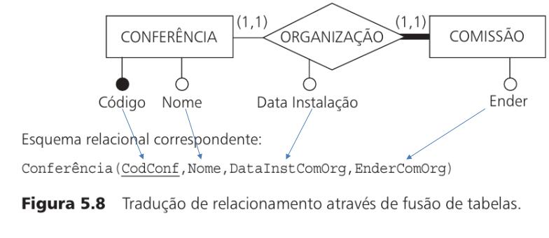
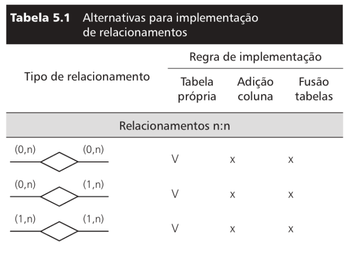

## Introdução à Relacionamentos
### A Abordagem Relacional 
- Fundamento teórico que estrutura os Sistemas de Gerenciamento de Bancos de Dados Relacionais (SGBDRs).
- Baseia-se no Modelo Relacional que organiza dados em relações (tabelas) compostas por atributos (colunas) e tuplas (linhas).

+ *Caracaterísticas*:
- **Estrutura tabular**: Dados são armazenados em tabelas
bidimensionais.
- **Chaves**: Uso de chaves primárias (identificação única de
linhas) e chaves estrangeiras (relacionamentos entre
tabelas).
- **Restrições de Integridade**: Garantem consistência dos dados
(ex: integridade referencial).
- **Atomicidade**: Campos (atributos) são atômicos (indivisíveis)
e monovalorados (um único valor por célula).

### Tabelas
- Uma tabela (ou relação) é a estrutura básica do modelo relacional, representada como uma coleção não ordenada de linhas (tuplas) e colunas (atributos).

- Atributos: Nomeados e tipados (CodigoEmpresa: INT). Cada atributo pertence a um domínio (conjunto de valores válidos) 

- Tuplas (linhas): Instâncias do dados que seguem uma estrutura definida pelos atributos. 

- Esquema de Tabelas: Definição formal dos atributos/restrições.
 > Empregado (CodigoEmp: INTEGER, Nome: VARCHAR, CodigoDepto: INTEGER, CategFuncional: INTEGER)

+ *Pontos crítcos*:
- Um campo não pode conter múltiplos valores.
- Ordem Irrelevante: Em tabelas, as tuplas são acessadas por chaves, não importando a posição, sendo a mesma apenas um forma de ordenação opcional.
- Tabelas devem evitar redundâncias.

---
- Representação:

---

---
- Linha: Uma instância única de dados dentro de uma tabela,correspondendo a um registro específico.
- Coluna: Uma coluna (ou atributo) define uma propriedade ou característica da tabela, com um nome e um tipo de dado específico (ex: INTEGER, VARCHAR).
- Campo: Um campo é o valor específico de um atributo para uma determinada linha (interseção entre linha e coluna).
- Chaves PK e FK e AK: As chaves garantem identificação única e relacionamentos entre tabelas.

### Chave primária (PK)
- É um atributo (ou conjunto de atributos) que *identifica* unicamente cada registro (linha) de uma tabela no banco de dados.

- *Unicidade*: Não pode haver duas linhas com o mesmo valor na PK.
- *Não-nulidade* (NOT NULL): A PK nunca pode ser NULL.
- *Imutabilidade* ideal: Evitar alterações para preservar
integridade referencial.
- Simples (1) e composta (N): Uma PK pode ser composta por um ou mais atributos

Exemplo: Em uma tabela de clientes, o CPF pode ser a PK, pois é único para cada cliente.

### Chave estrangeira (FK)
- É um atributo (ou conjunto de atributos) que *faz referência* à chave primária de outra tabela, estabelecendo um relacionamento entre as duas tabelas.

- Se a chave primária (PK) **identifica** um item, a chave estrangeira (FK) **faz ligação** com esse item em outra tabela.

---

####  Tabela: `Cliente`

| **CPF (PK)** | Nome  |
| ------------ | ----- |
| 12345678900  | José  |
| 98765432100  | Maria |

####  Tabela: `Pedido`

| **ID\_Pedido (PK)** | Data       | **CPF\_Cliente (FK)** |
| ------------------- | ---------- | --------------------- |
| 1                   | 03/05/2025 | 12345678900           |
| 2                   | 03/05/2025 | 98765432100           |

- `CPF` é a chave primária em `Cliente`
- `CPF_Cliente` é a chave estrangeira em `Pedido`, apontando para `Cliente`

- Integridade Referencial: O valor da FK deve existir na PK referenciada (ou ser NULL, se permitido).
- Restrições de Ação:
- Se a PK referenciada for excluída, as linhas com FK também
são.
- Impede a alteração da PK se houver FKs dependentes.

### Chave alternativa (AK)
- É um atributo (ou conjunto de atributos) que pode ser usado como uma chave primária alternativa, ou seja, é uma chave candidata que não foi escolhida como PK.	

+ Características Técnicas
- Unicidade: Não pode haver duas linhas com o mesmo valor na PK.
- Não-nulidade (NOT NULL): A PK nunca pode ser NULL.
- Multiplicidade: Uma tabela pode ter várias chaves candidatas/alternativas.

- Evitar Duplicações: PKs e AKs garantem registros únicos.
- Preservam Relacionamentos: FKs mantêm a consistência entre tabelas.
- Otimizam Consultas: Chaves são indexadas.

#### Exemplos:
---

---

### Restrições de Integridade
- Regras que garantem a consistência, precisão e confiabilidade dos dados em um banco de dados relacional. Elas são aplicadas pelo SGBD (Sistema de Gerenciamento de Banco de Dados) e classificam-se em quatro tipos principais:

+ *Integridade de Domínio*:
- Garante que os valores de um atributo (coluna) respeitem o domínio definido para ele (tipo de dado, formato, faixa de valores).
- Tipagem de Dados E Valores Válidos.

+ *Integridade de Vazio*:
- Define se uma coluna pode ou não armazenar valores NULL (vazios)..
Características:
- Coluna Obrigatória: NOT NULL (ex.: PKs).
- Coluna Opcional: Permite NULL (ex.: DataDemissao em Empregado).
- Impacto em Consultas: Colunas com NULL exigem tratamento especial em operações (ex.: WHERE Coluna IS NULL).

+ *Integridade de Chave (ou de Entidade)*
- Assegura que chaves primárias (PK) e chaves alternativas (AK) sejam únicas e não nulas em uma tabela.
- Características:
- Unicidade: Nenhuma linha pode ter valor repetido na PK ou AK.
- Não-nulidade: PKs não podem ser NULL.
- Implementação Automática.

+ *Integridade de Referência*
- Garante que chaves estrangeiras (FK) referenciem apenas valores existentes na chave primária da tabela relacionada (ou sejam NULL).

### **Esquema textual**:
- Esquema textual, compacto para exemplos iniciais e
organização de ideias.
- Exemplo:
---

---

### **Esquema Diagramatico**:
- Representação gráfica do esquema textual, facilitando a visualização de entidades, atributos e relacionamentos.

- Exemplo:
---

---

## Transformação de Modelos - Relacional para frente.
- O processo de transformação do modelo conceitual (ex: MER) para o modelo lógico (relacional) envolve regras específicas para mapear entidades, relacionamentos e generalizações em tabelas, colunas e chaves.

+ *Implementando Entidades*
- Regra Geral diz que cada entidade, será representada por uma tabela e seus atributos se tornam colunas.
- O atributo identificador se torna uma PK. Os demais atributos são representados normalmente.

 Exemplos:
- Entidade Pessoa, vira tabela Pessoa.
- Identificador se torna PK do tipo INT.
- Nome se torna coluna do tipo VARCHAR (String).
- DataNasc se torna coluna do tipo DATE/TIMESTAMP.

---

---

+ *Implementando Relacionamentos identificador*
- Para cada relacionamento identificador, é criada uma chave estrangeira na tabela que implementa a entidade identificada pelo relacionamento identificador.
- A chave primária é formada por:
- Colunas dos atributos identificadores.
- FKs que implementam relacionamentos identificadores.

---

---

- EXEMPLO:
---

---

---
## *Tabela Própria*:
- Note na imagem que o relacionamentp vai envolver as PKs das duas entidades, e o relacionamento entre elas, que é o que vai ser a chave primária da tabela de relacionamento.
---
- Essa tradução ocorre quando as duas entidades relacionadas tem cardinalidade máxima n.

---
+ Regras:
- Atributos identificadores do relacionamento devem se tornar PKs.
- Atributos identificadores das entidades da relação devem se tornar FKs e PKs. Se não houver atributos identificador no relacionamento.
- Atributos do relacionamento.

## *Adição de Colunas*
---

---
+ Regras:
- A tabela cujo a cardinalidade máxima é 1, ganha, além de seus atributos: 
- Colunas do identificador da entidade relacionada, representada em forma de FKs. 
- Atributos do relacionamento, se houver.

## *Funsão de tabelas*
- Quando o relacionamento entre duas entidades é 1:1, as duas entidades podem ser fundidas em uma única tabela.

---

---
+ Regras:
-  Atributos de ambas a entidades.
- Atributos do relacionamento, se houver.

## Resumindo:
---

---

---

---

---

### *Generalização e Especialização*:
- Para a implementação: 
- Uso de uma única tabela para toda hierarquia de generalização/especialização. 
- Uso de uma tabela para cada entidade.

+ **Uso de uma única tabela para toda hierarquia de generalização_especialização**
- Chave primária correspondente ao identificador da entidade mais genérico.
- Caso não exista, uma coluna Tipo, que identifica que tipo de entidade especializada está sendo representada por cada linha da tabela.
- Colunas referentes aos relacionamentos dos quais participa.
- Uma coluna para cada atributo de cada entidade especializada.
- Colunas referentes aos relacionamentos dos quais cada entidade especializada participa.

---

---

---

- Uso de uma tabela para cada entidade especializada.
- Identificar a entidade genérica e especializadas. 
- Colunas correspondentes ao identificador da entidade genérica serão PKs e FKs. 
- Uma coluna para cada atributo de cada entidade especializada. - Colunas referentes aos relacionamentos que a entidade especializada faz partes.