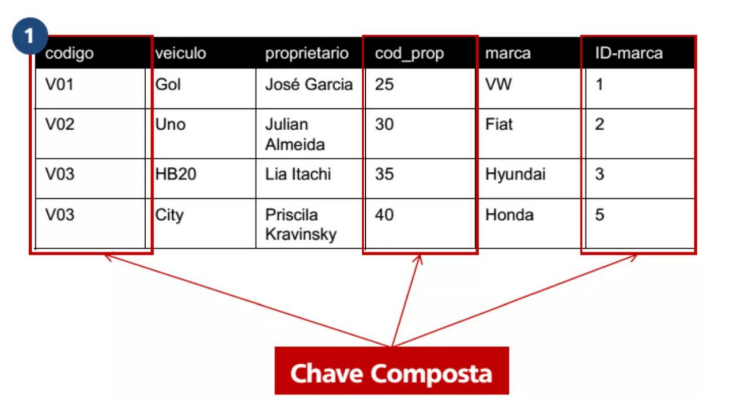
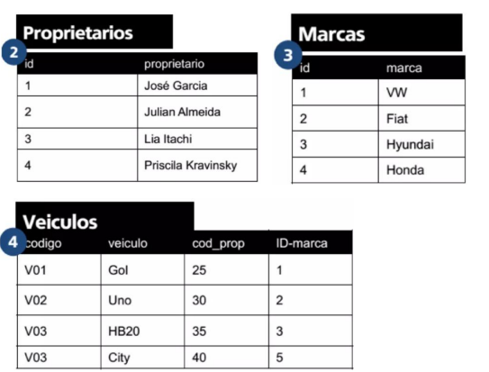

## 2FN: 2ª Forma Normal
- Baseada no conceito de dependência funcional total e parcial. Uma relação está na 2FN se: 
> O principal objetivo da 2FN é eliminar a dependência funcional parcial. Isso significa que, se você tem uma chave primária composta (formada por duas ou mais colunas), nenhum atributo que não seja parte da chave pode depender de apenas uma parte dessa chave. Ele tem que depender de toda a chave primária.

> Todas as colunas devem conter valores atômicos.

- **Estiver na 1FN e cada atributo não-chave for dependente ``total`` da chave primaria, todos os atributos não-chave, não podem ser parcialmente dependentes da chave primária.**

- Em tabelas com PK composta, se o atributo depender apenas de parte da PK, então esse atributo deve ser alocado em uma nova tabela.
### Dica
---
## Entendendo a 2ª Forma Normal (2FN)

A **2ª Forma Normal (2FN)** é o segundo passo no processo de normalização do seu banco de dados. O principal objetivo da 2FN é **eliminar a dependência funcional parcial**. Isso significa que, se você tem uma chave primária composta (formada por duas ou mais colunas), nenhum atributo que não seja parte da chave pode depender de *apenas uma parte* dessa chave. Ele tem que depender de *toda* a chave primária.

A dica que você mencionou é excelente para entender isso. Vamos desmembrá-la.

---

### Pré-requisito: Você precisa estar na 1ª Forma Normal (1FN)

Antes de sequer pensar na 2FN, sua tabela já precisa estar na **1ª Forma Normal (1FN)**. O que isso significa? Basicamente:

1.  **Todas as colunas devem conter valores atômicos:** Isso quer dizer que cada célula da sua tabela deve ter um único valor, não uma lista de valores. Por exemplo, uma coluna `Telefone` não pode ter "123-4567, 890-1234".
2.  **Não deve haver grupos repetitivos:** Não pode ter um conjunto de colunas que se repete para cada linha (tipo `Telefone1`, `Telefone2`, `Telefone3`). Cada linha deve ser única.

Se sua tabela já está na 1FN, podemos seguir para a 2FN.

---

### A Dica Explicada na Prática

- "Na 2FN, verifique se a tabela está na 1FN e tente considerar todos os atributos identificadores como se fossem uma chave composta. Teste cada atributo com os atributos da 'chave composta' e verifique se o atributo precisa do atributo identificador pra existir."

**Cenário de Exemplo: Tabela de `PEDIDOS_DETALHES`**

Imagine uma tabela que registra os itens de um pedido. A chave primária é **composta** por `(ID_Pedido, ID_Produto)`.

| ID\_Pedido | ID\_Produto | Nome\_Produto | Preço\_Unitário | Quantidade | Nome\_Cliente |
| :--------- | :---------- | :------------ | :-------------- | :--------- | :------------ |
| 1          | 101         | Camiseta      | 50.00           | 2          | Maria         |
| 1          | 102         | Calça         | 100.00          | 1          | Maria         |
| 2          | 101         | Camiseta      | 50.00           | 3          | João          |
| 3          | 103         | Tênis         | 150.00          | 1          | Maria         |

Aqui, nossa **chave composta é `(ID_Pedido, ID_Produto)`**. Para identificar *uma linha única* na tabela, você precisa saber o ID do Pedido **e** o ID do Produto.

Agora, vamos aplicar a dica e testar cada coluna que **não faz parte da chave primária**:

1.  **Coluna: `Quantidade`**
    * **Teste:** `Quantidade` precisa de `ID_Pedido` **E** `ID_Produto` para existir? Sim. 
2.  **Coluna: `Nome_Produto`**
    * **Teste:** `Nome_Produto` (por exemplo, "Camiseta") precisa de `ID_Pedido` **E** `ID_Produto` para existir? Não! O nome "Camiseta" depende **apenas** do `ID_Produto` (101). Você não precisa saber qual é o pedido para saber o nome do produto.
  

3.  **Coluna: `Preço_Unitário`**
    * **Teste:** `Preço_Unitário` (por exemplo, 50.00) precisa de `ID_Pedido` **E** `ID_Produto` para existir? Não! O preço de 50.00 depende **apenas** do `ID_Produto` (101).
    

4.  **Coluna: `Nome_Cliente`**
    * **Teste:** `Nome_Cliente` (por exemplo, "Maria") precisa de `ID_Pedido` **E** `ID_Produto` para existir? Não! O nome do cliente "Maria" depende **apenas** do `ID_Pedido` (1). Você não precisa saber o ID do produto para saber quem fez o pedido.
  

---

### Resolvendo os Problemas (Normalizando para 2FN)
- Com base nos nossos testes, faríamos o seguinte:

1.  **Tabela `ITENS_PEDIDO` (já na 2FN):**
    * **Chave Primária:** `(ID_Pedido, ID_Produto)`
    * **Colunas:** `Quantidade`
    * *(Note que `Nome_Produto`, `Preço_Unitário` e `Nome_Cliente` foram removidos daqui porque tinham dependência parcial.)*

    | ID\_Pedido | ID\_Produto | Quantidade |
    | :--------- | :---------- | :--------- |
    | 1          | 101         | 2          |
    | 1          | 102         | 1          |
    | 2          | 101         | 3          |
    | 3          | 103         | 1          |

2.  **Nova Tabela `PRODUTOS` (para `Nome_Produto` e `Preço_Unitário`):**
    * **Chave Primária:** `ID_Produto`
    * **Colunas:** `Nome_Produto`, `Preço_Unitário`

    | ID\_Produto | Nome\_Produto | Preço\_Unitário |
    | :---------- | :------------ | :-------------- |
    | 101         | Camiseta      | 50.00           |
    | 102         | Calça         | 100.00          |
    | 103         | Tênis         | 150.00          |

3.  **Nova Tabela `PEDIDOS` (para `Nome_Cliente`):**
    * **Chave Primária:** `ID_Pedido`
    * **Colunas:** `Nome_Cliente`

    | ID\_Pedido | Nome\_Cliente |
    | :--------- | :------------ |
    | 1          | Maria         |
    | 2          | João          |
    | 3          | Maria         |

### Processo de normalização para 2FN:
- Deve-se identificar os atributos que não são funcionalmente dependentes de toda a chave primária.
- Deve-se remover da entidade/tabela todos esses atributos identificados e alocar os mesmos em uma nova entidade/tabela.
- A chave primária da nova entidade será o atributo do qual os atributos removidos são funcionalmente dependentes.

---
- Temos dados de: Proprietário, Marca e Veículos.

---

