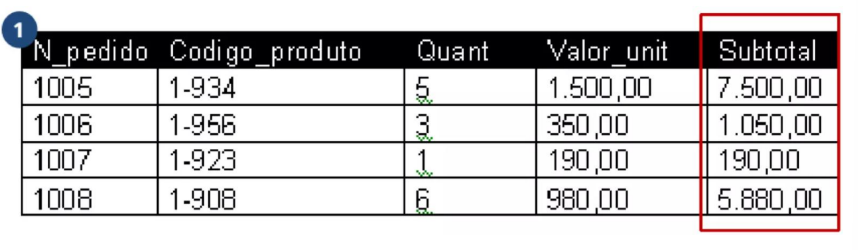

## 3FN: 3ª Forma Normal
- Baseada no conceito de dependência transitiva, uma tabela está na 3FN se.
- Estiver na 2FN. 
- Se nenhuma coluna não-chave depender de outra coluna não-chave. (Dependência transitiva).
- Temos de eliminar campos que podem ser obtidos pela equação de outros campos da mesma tabela. 
• Identificar todos os atributos que são funcionalmente dependentes de outros atributos não-chave.
• Removê-los.

## Exemplo:
- *O subtotal é o resultado da multiplicação de Quant por Valor_unit, dessa maneira, a coluna subtotal é(transitivamente) dependente de outras colunas não-chave. Para normalizar, é necessário remover a coluna subtotal.*

