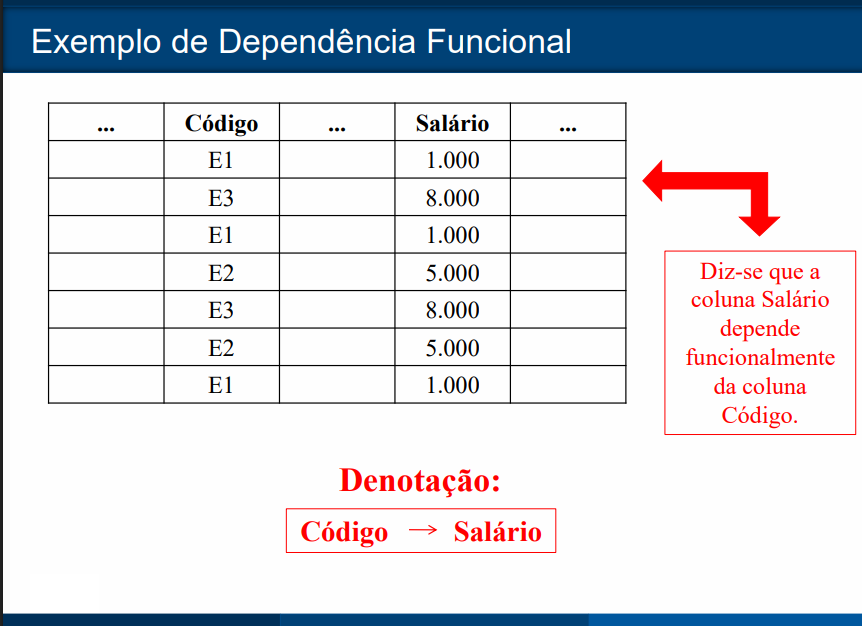
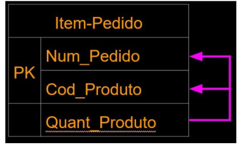
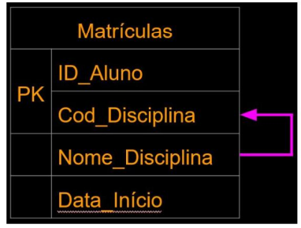
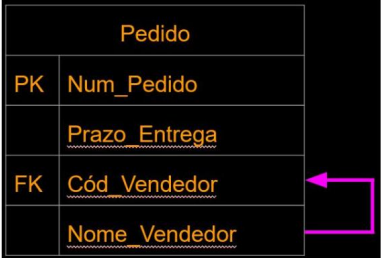

## Dependência Funcional 
- Em uma tabela relacional, diz-se que uma coluna C2 depende funcionalmente de uma coluna C1 (vice-versa) quando, em todas as linhas da tabela, para cada valor de C1 , aparecer o mesmo valor de C2. 
- Descreve a relação entre atributos de uma tabela, onde o valor de um atributo determina o valor de outro atributo.

---

---

---
## Dependência Funcional Total
- Em uma relação com uma PK composta, um atributo não-chave que dependa dessa PK como um todo, e não somente de parte dela, é dito como possuindo Dependência Funcional Total.

> Uma Dependência Funcional Total ocorre quando um atributo (ou conjunto de atributos) depende de todos os atributos da chave primária para ser determinado. A chave primária é o que identifica unicamente cada linha da sua tabela.

---

- Aqui, Quant_produto depende tanto de Num_Pedido
quanto de Cod_Produto, ao mesmo tempo.
- Obs: A dependência funcional total só pode ocorrer em tabela com chave primária composta.
---

## Dependência Funcional Parcial
- Uma dependência funcional é parcial quando os atributos não-chave não dependem funcionalmente de toda a PK quando
esta for composta.
> ma Dependência Funcional Parcial acontece quando um atributo não-chave (que não faz parte da chave primária) depende de apenas uma parte da chave primária, e não da chave primária completa. Isso geralmente ocorre em tabelas com chaves primárias compostas.
---

---
- Ou seja, existe uma dependência funcional, mas somente de uma parte da chave primária.
- Campo Nome_Disciplina é dependente de Cod_Disciplina, mas não do ID_Aluno.

## Dependência Funcional Transitiva
- Este tipo de dependência ocorre quando um campo não-chave não depende diretamente da chave primária da tabela (nem mesmo parcialmente), mas depende de um outro campo não-chave na tabela.
> Uma Dependência Funcional Transitiva acontece quando um atributo não-chave depende de outro atributo não-chave, e não diretamente da chave primária.
---

---
- No exemplo, o atributo Nome_Vendedor depende funcionalmente do Cód_Vendedor, que não é chave primária na tabela. Já o campo Prazo_Entrega depende da PK, Num_Pedido
