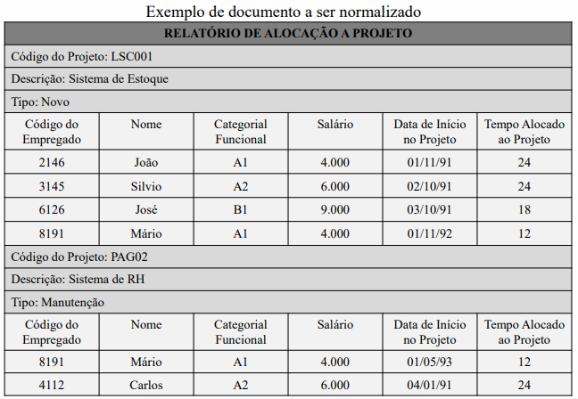
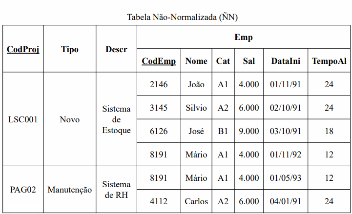

## Normalização
- Processo de organização de dados em um banco relacional para reduzir redundâncias e dependências.
---


---


- *Esquema textual do exemplo anterior*:
```
Proj (CodProj, Tipo, Descr,
(CodEmp, Nome, Cat, Sal, DataIni, TempoAl))
```

- Ao observar um projeto de banco de dados baseado em um
modelo relacional, temos a seguinte regra base.
- **“Não misturar assuntos diferentes em uma mesma tabela.”**
- Exemplo:
• Em uma tabela de clientes, deve-se apenas conter
campos relacionados com o assunto cliente.

## Passos anteriores:
- Eliminar redundâncias
- Tranformação em ER (Entidade-Relacionamento)
- Integração de modelos
- normalização do modelo relacional.
- Facilitar as manipulação em bancos de dados. Quando
os mesmo forem “traduzidos” para o modelo físico.
- Melhorar a performance dentro do SGBD e
- Facilitar a manutenção do sistema de informação.

## Normalização
- Obtido o esquema relacional correspondente ao
documento, passa-se ao processo de normalização.
- É uma regra que deve ser obedecida por uma tabela para que esta seja considerada “bem projetada”.

## Formas Normais
- Denominação:
- Primeira Forma Normal ou 1FN;
- Segunda Forma Normal ou 2FN;
- Terceira Forma Normal ou 3FN.

## Desvantagem
- Favorece a fragmentação exagerada (para normalização de tabelas maiores).
