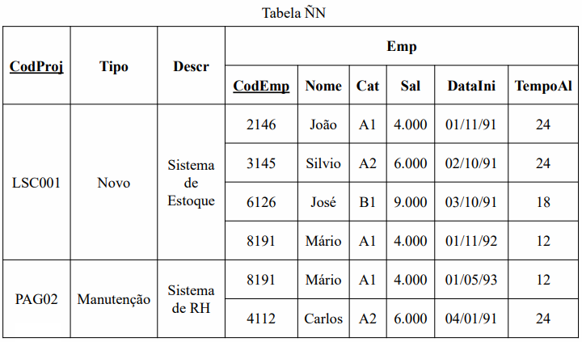
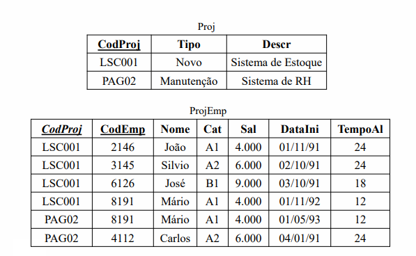
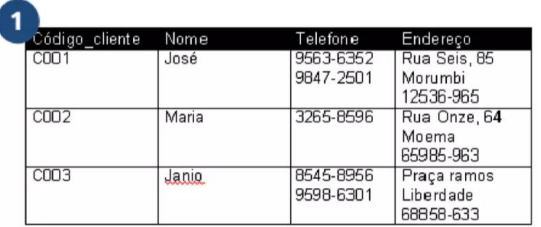

## 1FN: 1ª Forma Normal
### **Passagem à Primeira Forma Normal (1FN)**
- Diz-se que uma tabela está na primeira forma normal quando ela não contém tabelas aninhadas.
- Todos os *atributos* contêm apenas valores atômicos
(*indivisíveis*)
- Não existem grupos repetitivos ou relações aninhadas
(apenas um dado por coluna/linha)
- Existe uma chave primária
- Não possuem valores multivalorados ou compostos
- Todos os valores em um domínio são do mesmo tipo de
dados

> Uma relação está na primeira forma normal 1FN, se não houver grupos de dados repetidos, isto é, se todos os valores forem únicos.


---


---
### Há duas alternativas :
+ 1. Tabela única: cria-se uma tabela na qual os dados das linhas externas à tabela aninhada são repetidos para cada linha da tabela aninhada;
- Esquema textual da primeira alternativa
-**[] -> significa sublinhado**. 
``` 
ProjEmp ([CodProj], Tipo, Descr, [CodEmp], Nome, Cat,
Sal, DataIni, TempoAl)
```
+ 2. Decomposição de tabelas: cria-se uma tabela referente a própria tabela que está sendo normalizada e uma tabela para cada tabela aninhada.
- Esquema textual da segunda alternativa

```
Proj ([CodProj], Tipo, Descr)
ProjEmp ([CodProj], [CodEmp], Nome, Cat, Sal, DataIni,
TempoAl)
CodProj referencia Proj
```

## Passagem à Primeira Forma Normal (1FN) 
> A passagem à 1FN por decomposição de tabelas é feita nos seguintes passos:

* 1. É criada uma tabela na 1FN referente à tabela não-normalizada e que contém apenas as colunas com valores atômicos, isto é, sem tabelas aninhadas. A chave primária da tabela 1FN é idêntica à chave da tabela não-normalizada;

* 2. Para cada tabela aninhada, é criada uma tabela na 1FN composta pelas seguintes colunas:
- A chave primária de cada uma das tabelas nas quais a tabela em questão está aninhada (também deve ser definida como chave estrangeira).
- As colunas da própria tabela aninhada.

* 3. São definidas as chaves primárias das tabelas na 1FN que correspondem as tabelas aninhadas.

---
- Exemplo de Decomposição de Tabelas:



---

## Termos:
- Para determinar a chave primária de uma tabela aninhada, deve-se:
+ 1. Utilizar a chave primária da tabela aninhada na forma ÑN;
+ 2. Verificar se esta chave primária é suficiente.
• Caso seja suficiente, a chave primária da tabela na 1FN é a mesma que a da tabela aninhada na forma ÑN;
• Caso contrário, deve-se determinar quais as demais colunas necessárias para identificar as linhas da tabela na 1FN.
- A primeira forma normal (1FN) não admite repetições ou
campos multivalorados.

## Exemplo: 

- Todos os clientes possuem rua, cep, bairro, essas informações estão na mesma célula, para normalizar, cada informação deve estar em uma coluna diferente.

---

- Mesmo com o ajuste, ainda não está na 1FN, pois os cliente tem mais de um telefone. Para normalizar esse caso, seria necessário criar uma nova tabela com os telefone e o campo chave.

---

- Dica: Na 1FN, todos as atributos compostos devem ser divididos em novas colunas e atributos multivalorados, devem ser alocados em novas tabelas/entidades.
