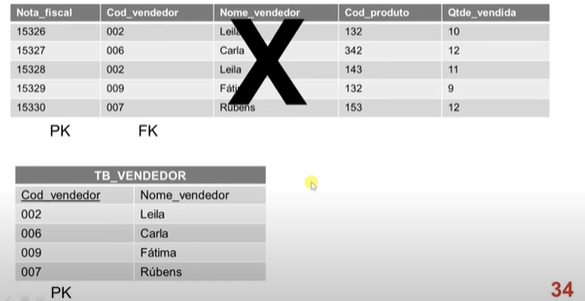

## INTRODUÇÃO:
1. 1FN: Extrair listas/aninhamentos para tabelas separadas.
2. 2FN: Criar chaves estrangeiras para relacionamentos.
3. 3FN: Eliminar atributos dependentes de não-chave (ex.: Artista depende de Musica_ID?).

## 1FN: 1ª Forma Normal
- Garantir a Atomicidade ajustando atributos multivalorados, compostos e suas combinações.
- Sem aninhamento.
> IDs podem ser adicionados.

> Uma relação está na primeira forma normal 1FN, se não houver grupos de dados repetidos, isto é, se todos os valores forem únicos. 

+ 2. Decomposição de tabelas: cria-se uma tabela referente a própria tabela que está sendo normalizada e uma tabela para cada tabela aninhada.

## Passagem à Primeira Forma Normal (1FN) 
> A passagem à 1FN por decomposição de tabelas é feita nos seguintes passos:

* 1. É criada uma tabela na 1FN referente à tabela não-normalizada e que contém apenas as colunas com valores atômicos, isto é, sem tabelas aninhadas. A chave primária da tabela 1FN é idêntica à chave da tabela não-normalizada;

* 2. Para cada tabela aninhada, é criada uma tabela na 1FN composta pelas seguintes colunas:
- A chave primária de cada uma das tabelas nas quais a tabela em questão está aninhada (também deve ser definida como chave estrangeira).
- As colunas da própria tabela aninhada.

* 3. São definidas as chaves primárias das tabelas na 1FN que correspondem as tabelas aninhadas.

### Observe os relacionamentos, cardinalidades para construir as tabelas 1FN/2FN. 
## RELACIONAMENTOS:
- Tabela própria: o relacionamento virá uma tabela com as PKs das entidades. 

> 1:N ---- 1:N 
- Adição de coluna: Adiona a Pk da tabela com o cardinalidade (1:1) na tabela que tem a cardinalidade próxima (1:n).
> 1:n ---- 1:1

- Fusão de Tabelas: Junta ambas tabelas, com a tabela predominante sendo a não dependente, com sua Pk e a pk da outra virando Fk.  
> 1:1 ---- 1:1

## 2FN: 2ª Forma Normal
> O principal objetivo da 2FN é eliminar a dependência funcional parcial. Isso significa que, se você tem uma chave primária composta (formada por duas ou mais colunas), nenhum atributo que não seja parte da chave pode depender de apenas uma parte dessa chave. Ele tem que depender de toda a chave primária.
- Estiver na 1FN.
- Em tabelas com PK composta, se o atributo depender apenas de parte da PK, então esse atributo deve ser alocado em uma nova tabela.

### Processo
- Se a tabela tiver uma chave, então ela permenece.
- “a coluna depende de toda a chave ou de apenas parte dela?”

- Caso a coluna dependa de toda a chave:
>i. Criar a coluna correspondente na tabela com a chave completa na 2FN.
• Caso a coluna dependa de apenas parte da chave:
> i. Criar, caso ainda não exista, uma tabela na 2FN que tenha comochave primária a parte da chave que é determinante da coluna em questão;
> ii. A coluna determinante deve permanecer também na tabela original como chave estrangeira;
> iii. Criar a coluna dependente dentro da tabela na 2FN.

## 3FN: 3ª Forma Normal
- Estiver na 2FN. 
- Se nenhuma coluna não-chave depender de outra coluna não-chave. (Dependência transitiva).
- Temos de eliminar campos que podem ser obtidos pela equação de outros campos da mesma tabela. 
• Identificar todos os atributos que são funcionalmente dependentes de outros atributos não-chave.

## Detalhes:
- Uma dependência (funcional) transitiva ocorre quando uma coluna, além de depender da chave primária da tabela, depende de outra coluna ou conjunto de colunas da tabela não-chave. 

## Processo:
- Manter as tabelas com menos de uma chave.

- Para tabelas com duas ou mais colunas não-chave:
- “a coluna depende de alguma outra coluna não-chave?”

- Caso a coluna dependa apenas da chave:
i. Copiar a coluna para a tabela na 3FN.

• Caso a coluna dependa de outra coluna:
> i. Criar, caso ainda não exista, uma tabela na 3FN que tenha como chave primária a coluna da qual há a dependência transitiva;
ii. Copiar a coluna dependente para a tabela criada;
iii. A coluna determinante deve permanecer também na tabela original como chave estrangeira.

- EXEMPLO:
---

---