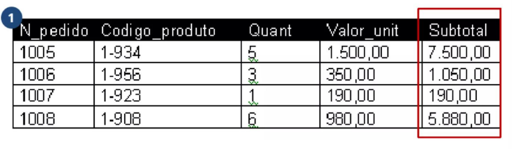
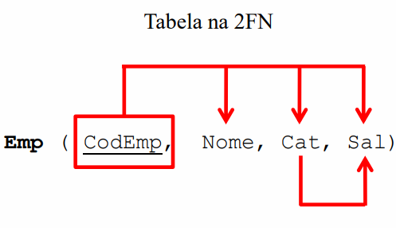
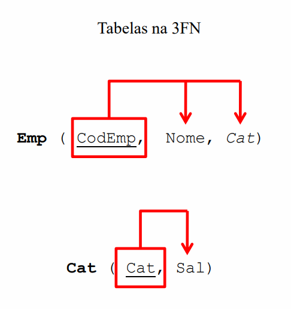

## 3FN: 3ª Forma Normal
- Baseada no conceito de dependência transitiva, uma tabela está na 3FN se.
- Estiver na 2FN. 
- Se nenhuma coluna não-chave depender de outra coluna não-chave. (Dependência transitiva).
- Temos de eliminar campos que podem ser obtidos pela equação de outros campos da mesma tabela. 
• Identificar todos os atributos que são funcionalmente dependentes de outros atributos não-chave.
• Removê-los.

## Exemplo:
- *O subtotal é o resultado da multiplicação de Quant por Valor_unit, dessa maneira, a coluna subtotal é(transitivamente) dependente de outras colunas não-chave. Para normalizar, é necessário remover a coluna subtotal.*

## Detalhes:
- Uma dependência (funcional) transitiva ocorre quando uma coluna, além de depender da chave primária da tabela, depende de outra coluna ou conjunto de colunas da tabela. 

---

---

## Processo:
- Manter as tabelas com menos de uma chave.

- Para tabelas com duas ou mais colunas não-chave:
- “a coluna depende de alguma outra coluna não-chave?”

- Caso a coluna dependa apenas da chave:
i. Copiar a coluna para a tabela na 3FN.

• Caso a coluna dependa de outra coluna:
i. Criar, caso ainda não exista, uma tabela na 3FN que tenha como chave primária a coluna da qual há a dependência transitiva;
ii. Copiar a coluna dependente para a tabela criada;
iii. A coluna determinante deve permanecer também na tabela original como chave estrangeira.